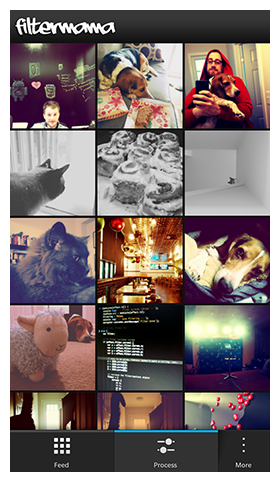
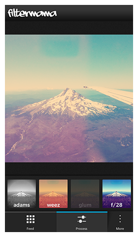
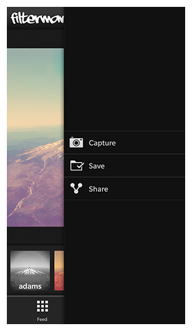
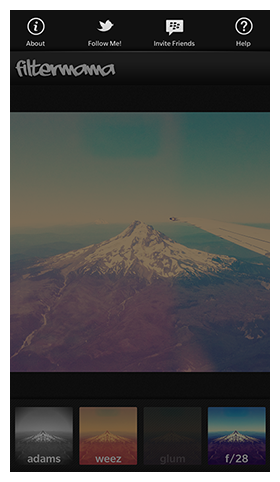

# Filtermama Lite

Filtermama Lite, written by [@chadtatro](http://www.twitter.com/chadtatro) is a full-blown "Showcase" application written for BlackBerry 10. It combines the flexibility of JavaScript, with the power of BlackBerry Cascades, and C++ to deliver a true **Hybrid** app.

The "full" version of [Filtermama](http://appworld.blackberry.com/webstore/content/27283379) is available for free in BlackBerry World.

If you'd like to learn more about Hybrid apps, and specifically how I made Filtermama, a full write-up is available here: [Nobody puts Filtermama in the corner](http://palebanana.com/nobody-puts-filtermama-in-the-corner/)

The sample code for this application is Open Source under the [Apache 2.0 License](http://www.apache.org/licenses/LICENSE-2.0.html).

**Applies To**

* [BlackBerry 10.1 Native SDK](https://developer.blackberry.com/native/downloads/)

**Author(s)** 

* [Chad Tetreault](http://www.twitter.com/chadtatro)

**Built for BlackBerry**

Filtermama has passed testing, and is designated as a [Built for BlackBerry](http://developer.blackberry.com/builtforblackberry/) app. I used the Built for BlackBerry boilerplate to get started quick. There are two Cascades versions available.

* [10.2 BfB Boilerplate](https://github.com/blackberry/Cascades-Samples/tree/master/BfB-Boilerplate-10.2)
* [10.1 BfB Boilerplate](https://github.com/blackberry/Cascades-Samples/tree/master/BfB-Boilerplate-10.1)

**Hybrid Apps**

To learn more about creating Hybrid apps for BlackBerry 10, check-out [Anzor Bashkhaz's](https://twitter.com/anzor_b) blog series on the BlackBerry DevBlog: [Hybrid Apps for BlackBerry 10](http://devblog.blackberry.com/2014/01/hybrid-apps-for-blackberry-10-an-introduction/).

**Attributions**

1. [Filter.me](http://matthewruddy.com) is dual licensed under the [Apache 2.0](http://www.apache.org/licenses/LICENSE-2.0.html) or [GPL](http://www.opensource.org/licenses/gpl-license.php) licenses.

2. [jQuery](http://code.jquery.com/jquery-1.7.2.js) is [licensed](http://jquery.org/license/) under the MIT license.

3. Fonts used in the headers, and splash screens are [Aaaiight](http://www.fonts4free.net/aaaiight-font.html) by JW/SWE, and are distributed as "Freeware" via [Fonts4Free.net](http://www.fonts4free.net/aaaiight-font.html).

4. Some icons used are part of the [Liz Myers](http://www.myersdesign.com) Icon set and are [licensed](http://creativecommons.org/licenses/by/3.0/) under the CC-BY-3.0 license.

**Special Thanks**

Big shout-outs to the following people, for helping me get past roadblocks along the way

* [Kyle Fowler](http://www.twitter.com/kfow35)
* [Jerome Carty](http://www.twitter.com/jcarty)
* [Anzor Bashkhaz](http://www.twitter.com/anzor_b)
* [Isaac Gordezky](https://github.com/igordezky)

## Screenshots ##

## How To Build

1. Clone the repo to your computer.
2. Launch BlackBerry 10 Native SDK, and from the File menu, select Import.
3. Expand General, and select Existing Projects into Workspace. Click Next.
4. Browse to the location where you extracted the sample file, and then click OK.
5. The sample project should display in the Projects section. 
   Click Finish to import the project into your workspace.
6. In the Project Explorer pane, Right-click the project (for example hellocascades) 
   and select Build Project.
7. In the Project Explorer pane, Right-click the project (for example hellocascades) 
   and select Run As > BlackBerry C/C++ Application.
8. The application will now install and launch on your device. If it doesent you might
   have to [set up your environment](http://developer.blackberry.com/cascades/documentation/getting_started/setting_up.html).

## More Info

* [BlackBerry Cascades & NDK](https://developer.blackberry.com/native) - Downloads, Getting Started guides, samples, code signing keys.
* [Native Development Guides](https://developer.blackberry.com/native/documentation/cascades/)
* [BlackBerry Native Development Forums](https://developer.blackberry.com/native/documentation/cascades/)

## Disclaimer

THE SOFTWARE IS PROVIDED "AS IS", WITHOUT WARRANTY OF ANY KIND, EXPRESS OR IMPLIED, INCLUDING BUT NOT LIMITED TO THE WARRANTIES OF MERCHANTABILITY, FITNESS FOR A PARTICULAR PURPOSE AND NONINFRINGEMENT. IN NO EVENT SHALL THE AUTHORS OR COPYRIGHT HOLDERS BE LIABLE FOR ANY CLAIM, DAMAGES OR OTHER LIABILITY, WHETHER IN AN ACTION OF CONTRACT, TORT OR OTHERWISE, ARISING FROM, OUT OF OR IN CONNECTION WITH THE SOFTWARE OR THE USE OR OTHER DEALINGS IN THE SOFTWARE.

